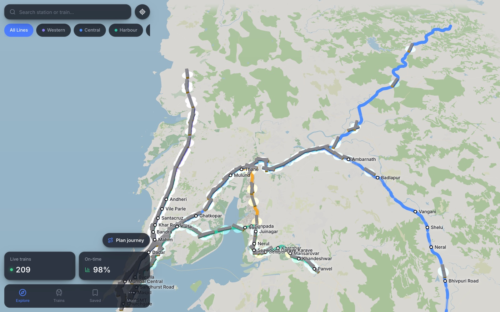
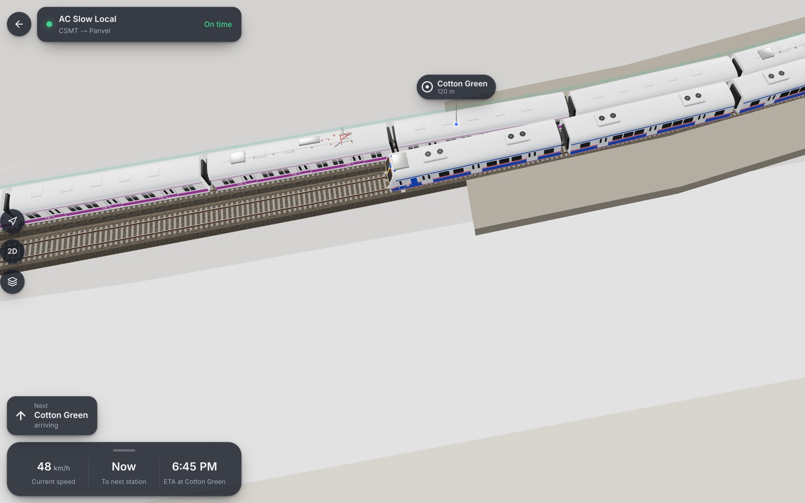
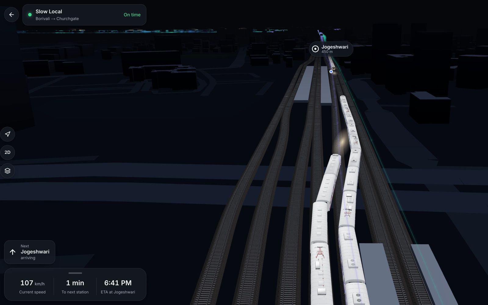
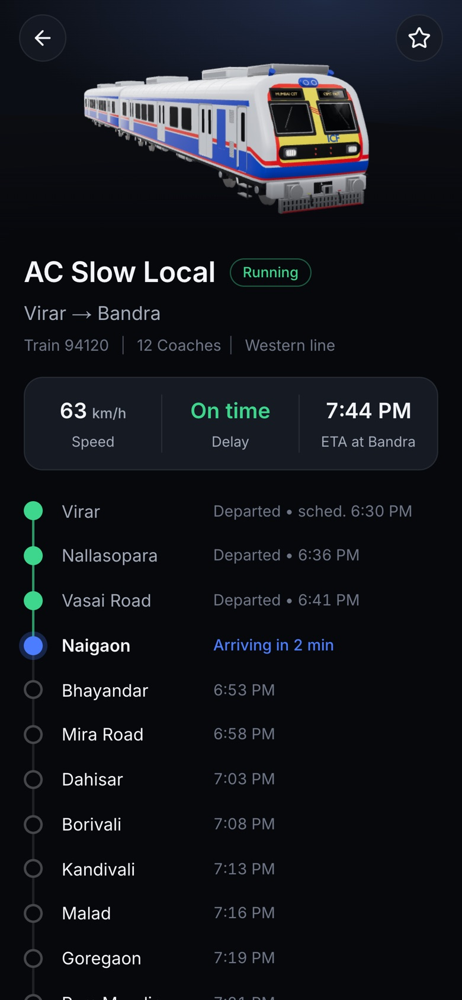
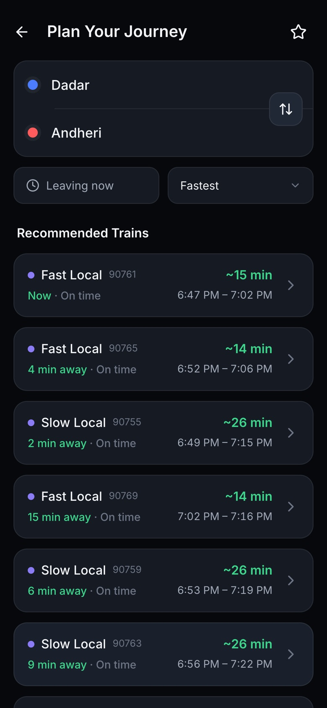

# RailView

Real-time 3D tracking for Mumbai's suburban local trains, built mobile-first.
It covers four lines:

| Line | Routes |
| --- | --- |
| Western | Churchgate – Virar |
| Central | CSMT – Kasara and CSMT – Khopoli via Karjat (forking at Kalyan) |
| Harbour | CSMT – Panvel, CSMT – Goregaon (forking at Wadala Road), Panvel – Goregaon |
| Trans-Harbour | Thane – Vashi and Thane – Panvel (forking at Turbhe) |

The trains on the map are the ones Central and Western Railway's
**official timetable** has running at that moment, with their real train
numbers, service codes and rakes: around 200 at a time, about 3,000 a
day. Their exact positions and delays are **simulated**, through the same
pipeline a real feed would use. No authorised real-time feed for Mumbai
locals is connected yet (see [Live data](#live-data)).

The 3D view shows where your train is, how far it is from the next
station, and whether it's on time. Station positions, track centrelines,
the individual tracks and platforms at every station, buildings, roads,
land cover (parks, forest, mangroves, farmland, beaches) and the coastline
all come from OpenStreetMap. Train positions live in the same
rail-relative coordinate system from the backend to the scene.

The map has a **Day** mode in real-world colours and a **Night** mode.
**Auto**, the default, switches at the actual sunrise and sunset over
Mumbai, and by day the scene is lit from where the sun really is.

## Screenshots

**The whole network, live.** Every train the timetable has running right
now, on the real track geometry of Mumbai and Navi Mumbai.



**Up close, the real trains.** Each local is a 12-coach model of Mumbai's
ICF rakes, in its own livery: a stainless, blue-and-red AC local (CSMT →
Panvel) passing a non-AC rake near Cotton Green, on individually modelled
tracks.



**Following a train at night.** The camera rides behind the train with
its speed, the next station and its ETA; at night the leading cab lights
the line ahead.



**Every stop, and the next train home.** A train's timeline with the
official times and its live delay, and direct trains between any two
stations, fastest first.

<p>
  
  &nbsp;
  
</p>

## How it works

```
Telemetry source (timetable-driven simulator today, authorised feed later)
        |  raw, noisy GPS fixes
        v
Position processor   snaps each fix onto the train's route (GPS-to-track
        |            matching), smooths chainage with a Kalman filter to
        |            get speed and direction, and compares progress with
        |            the timetable for current/next station, ETA and delay
        v
Live train cache     last-known state per train; marks a train "stale"
        |            after 15 s of silence instead of inventing positions
        v
WebSocket hub        one snapshot per tick to every client (/ws/live): a
        |            deflated table, full every 10 s and only what moves in
        |            between (~5 KB/s for ~200 trains); a client on a slow
        |            connection skips snapshots instead of delaying everyone
        |            else, and the app drops the feed while it's hidden
        v
Next.js client       glides each train along the track over the measured
                     time between snapshots and renders it on the track
                     its direction runs on
```

### Network model

- A **line** (Central, Western...) is what commuters see: a name and a
  colour. A **route** is one end-to-end path trains run on. Central has
  two routes that share the trunk up to Kalyan; Harbour's fork at Wadala
  Road, with Panvel – Goregaon trains running through it. Track matching,
  simulation and timetables all work per route.
- **Chainage** (metres along a route from its first station) is how
  every position is addressed on both the server and the client.
- **Left-hand running.** Mumbai runs on the left, so Up trains (towards
  CSMT or Churchgate) and Down trains keep to different tracks. The data
  build measures, every 10 m along each route, the sideways offset to
  each direction's real track. The client draws trains there, and at a
  terminus both directions share the platform track before crossing over.

## Running locally

Backend (in-memory, no database needed):

```bash
cd backend
uv sync
uv run uvicorn app.main:app --reload --port 8000
```

Frontend:

```bash
cd frontend
npm install
cp .env.local.example .env.local
npm run dev -- --port 3010
```

Checks: `uv run ruff check . && uv run pytest` in `backend/`;
`npm run lint && npx tsc --noEmit && npm run build` in `frontend/`.

### Rebuilding the map data

```bash
cd backend
uv run python scripts/build_osm_data.py            # uses the local Overpass cache
uv run python scripts/build_osm_data.py --refresh  # refetches from OpenStreetMap
```

This regenerates `backend/app/data/generated/network.json` and
`frontend/public/city/*`. Both are committed, so you don't need to run
it just to work on the app.

### Importing the official timetable

```bash
cd backend
uv run python scripts/import_timetables.py
```

Reads the Pocket Time Table PDFs that Central and Western Railway publish
(the sources, their URLs and SHA-256 hashes are listed in
`scripts/import_timetables.py` and in the output), kept in
`backend/data/timetables/`, and writes
`backend/app/data/generated/timetable.json`: about 3,000 trains with
number, service code, direction, AC and 12/15-car rake, running days and
the time at every stop.

The PDFs are read by word position rather than by table extraction,
which merges neighbouring trains on some pages. The importer fails on
anything it can't place: an unknown station, times running backwards, or
a train number used twice. Quirks it resolves are recorded under
`corrections` in the output:

- Harbour trains that turn onto the Goregaon branch are printed in two
  halves (Up to Wadala Road, then Down). These are joined.
- Stretches reprinted in another table (for example Thane – Panvel
  trains in the Harbour table) are dropped for the full listing.
- Where two official timetables disagree about a train, the newer one
  wins.
- A time printed 12 hours out (12:28 for 00:28) is corrected when both
  neighbouring stops confirm it.

### Database (optional)

With a PostGIS database reachable at `DATABASE_URL`:

```bash
cd backend
uv run alembic upgrade head
uv run python scripts/seed_db.py
```

## Live data

There is no public, freely licensed real-time GPS feed for Mumbai locals.
A live source plugs in by implementing `TelemetrySource` and
`ScheduleProvider`; nothing downstream changes. Trains then keep their
timetable identity, and only their positions come from the feed.

## Attribution

Map data © OpenStreetMap contributors, available under the
[ODbL](https://www.openstreetmap.org/copyright).
